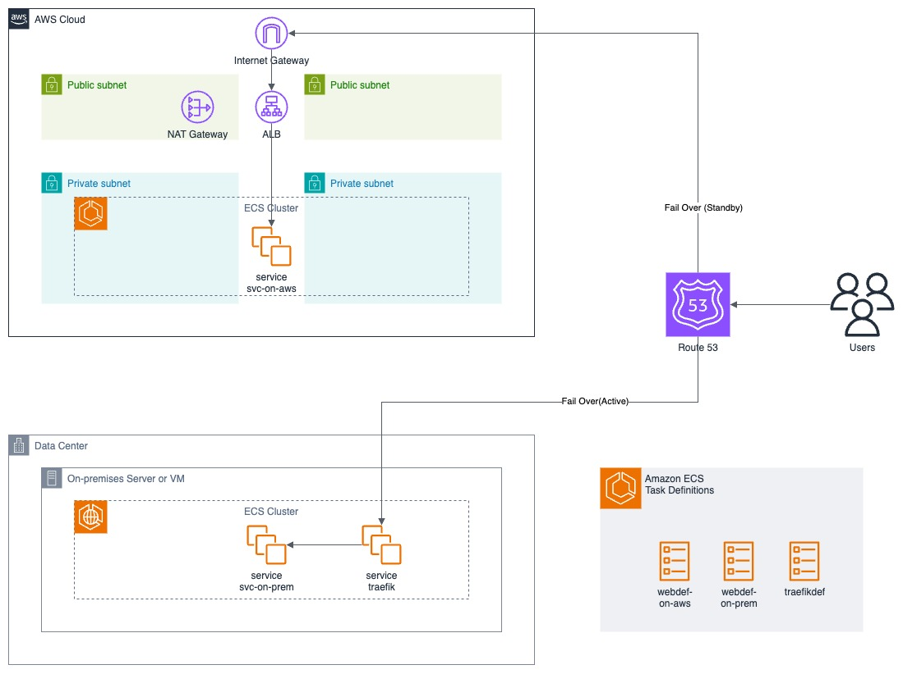

# 실습 소개

## Overall Architecture

<figure><figcaption></figcaption></figure>

## 실습 필요

* 해당 실습을 하기 위해서는 Route 53의 퍼블릭 호스팅 영역(Public Hosted Zone) 에서 활용할 수 있는 **개인 소유의 도메인 주소가 반드시 필요**합니다.

## 실습 범위

* 해당 실습에서는 AWS VPC에서 운영 되는 인스턴스 와 가상의 on-premise 환경에 존재하는 서버를 같은 ECS Cluster에 구성합니다.
  * 가상의 On-Premise 환경은 default VPC 를 이용합니다.
* Launch Type(EC2, EXTERNAL) 각각의 ECS Service(AWS - svc-on-aws, On-Prem - svc-on-prem) 를 생성합니다. Task Definition과 Service 는 나누어져 있지만, 실제 동작하는 워크로드 컨테이너는 같습니다.
* 각 ECS Service의 Endpoint (AWS - ALB, On-Prem - Traefik) 를 Route 53의 장애 조치(failover) 라우팅으로 구성합니다.

