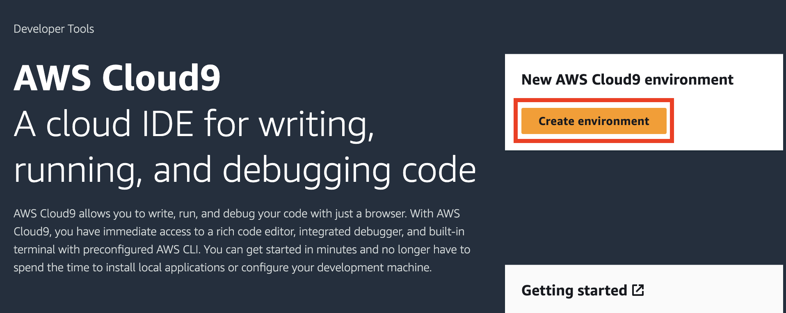

# Cloud9 환경 구성

1. [AWS Cloud9 ](https://ap-northeast-2.console.aws.amazon.com/cloud9/) 으로 이동합니다.
2.  새로운 Cloud9 환경 생성을 위해 **Create environment** 를 클릭합니다.\


    <figure><figcaption></figcaption></figure>
3.  Cloud9 환경 이름을 `ecsworkshop` 로 입력합니다.\


    <figure><figcaption></figcaption></figure>
4.  Cloud9 인스턴스 타입을 선택합니다. Additional instance type을 클릭하고, **t3.large** 를 선택합니다.\


    <figure><figcaption></figcaption></figure>
5.  Cloud9 인스턴스의 네트워크 환경을 설정합니다. 연결 방법은 AWS System Manager(SSM)로 그대로 둡니다. 앞서 배포한 VPC **ECSWorkshopVPC** 와 **PublicSubnet1** 를 각각 선택하고 Create를 선택합니다. Cloud9 환경이 생성 완료될 때까지 기다립니다.\


    <figure><figcaption></figcaption></figure>
6.  앞에서 생성한 Cloud9 환경 생성이 완료된 후 Cloud9 인스턴스의 open 버튼을 클릭하여 IDE 환경을 엽니다.\


    <figure><figcaption></figcaption></figure>
7. Cloud9에서 사용할 CLI 도구들을 업데이트 및 설치합니다.

```
sudo pip install --upgrade awscli
sudo yum install -y jq

```

8. 현재 실습하고 있는 리전을 기본값으로 설정하기 위해 아래 명령어를 터미널에 입력합니다.

```
TOKEN=`curl -X PUT "http://169.254.169.254/latest/api/token" -H "X-aws-ec2-metadata-token-ttl-seconds: 21600"`
export AWS_REGION=$(curl -H "X-aws-ec2-metadata-token: $TOKEN" http://169.254.169.254/latest/meta-data/placement/region)
echo "export AWS_REGION=${AWS_REGION}" | tee -a ~/.bash_profile
aws configure set default.region ${AWS_REGION}

```

9. 현재 실습을 진행하는 계정 ID를 환경 변수로 등록합니다.

```
export AWS_ACCOUNT_ID=$(aws sts get-caller-identity --query 'Account' --output text)
echo "export AWS_ACCOUNT_ID=${AWS_ACCOUNT_ID}" | tee -a ~/.bash_profile

```

10. 우측 상단 톱니바퀴 버튼을 클릭해 AWS Settings > Credentials 의 체크박스를 해제합니다.

<figure><figcaption></figcaption></figure>

11. Cloud 9 인스턴스에 연결 된 [AWSCloud9SSMAccessRole](https://us-east-1.console.aws.amazon.com/iam/home?region=ap-northeast-2#/roles/details/AWSCloud9SSMAccessRole) (클릭시 역할 콘솔 화면으로 넘어갑니다)에 **AdministratorAccess** 권한을 추가합니다.\


    <figure><figcaption></figcaption></figure>

    <figure><figcaption></figcaption></figure>
